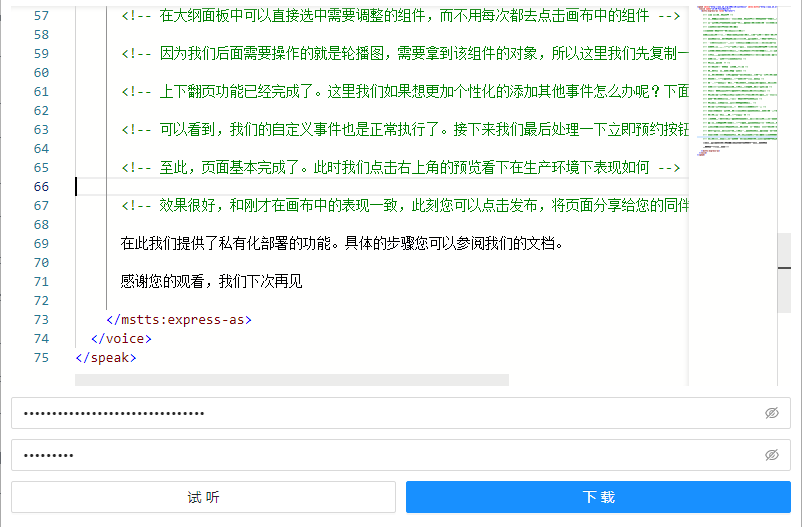
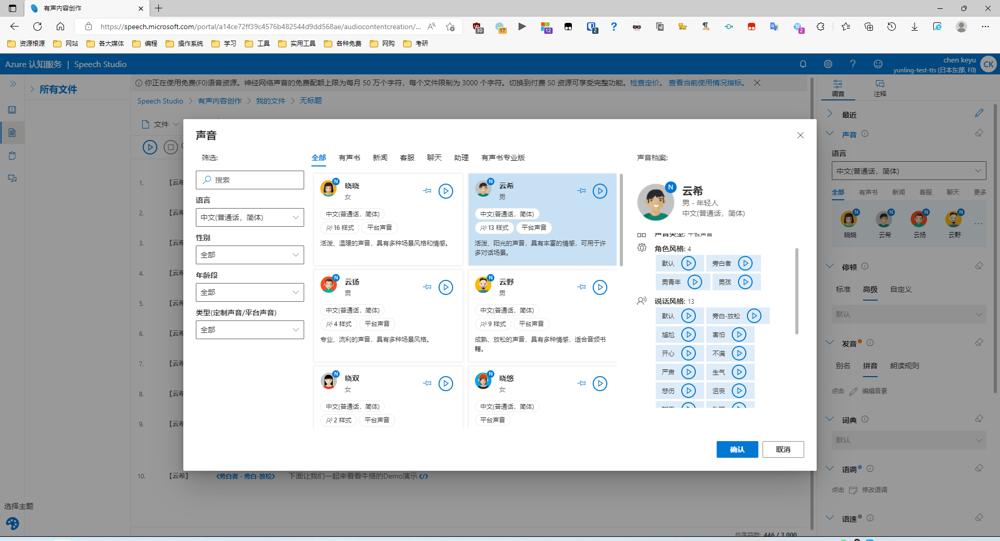
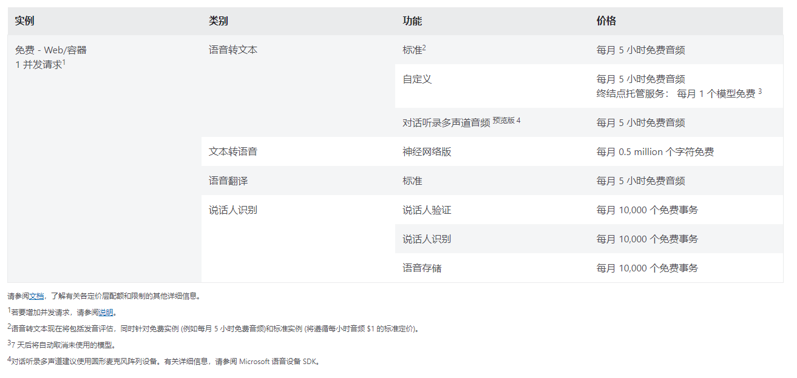

# 在web页面中使用azure文字转语音功能

网页地址：https://james-curtis.github.io/azure-tts-web/

**仅**支持 [SSML](https://docs.microsoft.com/zh-cn/azure/cognitive-services/speech-service/speech-synthesis-markup?tabs=csharp)



参考示例：

> 抖音：https://www.douyin.com/video/7096410070052867341

azure tts：[mp3](https://github.com/james-curtis/azure-tts-web/raw/main/docs/demo/%E6%8A%96%E9%9F%B3id7096410070052867341.mp3)

SSML代码
```xml
<speak
  xmlns="http://www.w3.org/2001/10/synthesis"
  xmlns:mstts="http://www.w3.org/2001/mstts"
  xmlns:emo="http://www.w3.org/2009/10/emotionml" version="1.0" xml:lang="zh-CN">
  <voice name="zh-CN-YunxiNeural">
    <s />
    <mstts:express-as role="Narrator" style="serious">这个连饭都吃不起的流浪汉，却用全身的积蓄，买了盒手写体英文卡片，这些钱足以让他饱餐一顿</mstts:express-as>
    <s />
    <mstts:express-as role="Narrator" style="serious">而他买卡片。只是因为他捡到一本日记，本子上没有藏宝图，只是一个小女孩的碎碎念
      他看了第一篇，小女孩说妈妈去世了，只留下这个本子，让她每天记录生活，这样妈妈就能在天堂看到
      他翻到下一页，字体变成手写体英文，他看不懂，向周围人求助，可周围也都是流浪汉</mstts:express-as>
  </voice>
</speak>
```

纯文本
```text
这个连饭都吃不起的流浪汉，却用全身的积蓄，买了盒手写体英文卡片，这些钱足以让他饱餐一顿
而他买卡片。只是因为他捡到一本日记，本子上没有藏宝图，只是一个小女孩的碎碎念
他看了第一篇，小女孩说妈妈去世了，只留下这个本子，让她每天记录生活，这样妈妈就能在天堂看到
他翻到下一页，字体变成手写体英文，他看不懂，向周围人求助，可周围也都是流浪汉
```

# 墙裂推荐 Azure [有声内容创作门户](https://aka.ms/audiocontentcreation)


# Q/A

### 代码都是存您的本机，请知晓
```tsx
class Storage {
  static getItem(key: string) {
    if (IN_UTOOLS) return utools.dbStorage.getItem(key)
    return localStorage.getItem(key);
  }

  static setItem(key: string, data: any) {
    if (IN_UTOOLS) return utools.dbStorage.setItem(key, data)
    return localStorage.setItem(key, data);
  }
}
```

### 免费额度

参考官网：https://azure.microsoft.com/zh-cn/pricing/details/cognitive-services/speech-services/

